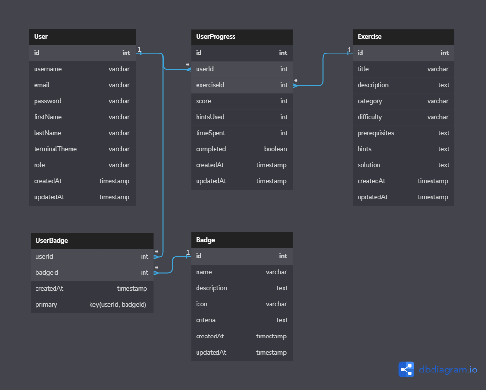

# Database Schema

## 6.1 Schema Diagram



## 6.2 DBML

```dbml
Table User {
  id int [pk, increment]
  username varchar [unique, not null]
  email varchar [unique, not null]
  password varchar [not null]
  firstName varchar
  lastName varchar
  terminalTheme varchar
  role varchar [default: 'user']
  createdAt timestamp
  updatedAt timestamp
}

Table Exercise {
  id int [pk, increment]
  title varchar [not null]
  description text
  category varchar
  difficulty varchar
  solution text
  createdAt timestamp
  updatedAt timestamp
}

Table Hints {
  id int [pk, increment]
  exerciseId int [ref: > Exercise.id, not null]
  hint text [not null]
  createdAt timestamp
  updatedAt timestamp
}

Table UserProgress {
  id int [pk, increment]
  userId int [ref: > User.id, not null]
  exerciseId int [ref: > Exercise.id, not null]
  score int
  hintsUsed int
  timeSpent int
  completed boolean [default: false]
  createdAt timestamp
  updatedAt timestamp
}

Table Badge {
  id int [pk, increment]
  name varchar [not null]
  description text
  icon varchar
  criteria text
  createdAt timestamp
  updatedAt timestamp
}

Table UserBadge {
  userId int [ref: > User.id, not null]
  badgeId int [ref: > Badge.id, not null]
  createdAt timestamp
  updatedAt timestamp
  primary key (userId, badgeId)
}
```

## 6.3 PostgreSQL

```sql
CREATE TABLE "User" (
  "id" INT GENERATED BY DEFAULT AS IDENTITY PRIMARY KEY,
  "username" varchar UNIQUE NOT NULL,
  "email" varchar UNIQUE NOT NULL,
  "password" varchar NOT NULL,
  "firstName" varchar,
  "lastName" varchar,
  "terminalTheme" varchar,
  "role" varchar DEFAULT 'user',
  "createdAt" timestamp,
  "updatedAt" timestamp
);

CREATE TABLE "Exercise" (
  "id" INT GENERATED BY DEFAULT AS IDENTITY PRIMARY KEY,
  "title" varchar NOT NULL,
  "description" text,
  "category" varchar,
  "difficulty" varchar,
  "solution" text,
  "createdAt" timestamp,
  "updatedAt" timestamp
);

CREATE TABLE "Hints" (
  "id" INT GENERATED BY DEFAULT AS IDENTITY PRIMARY KEY,
  "exerciseId" int NOT NULL,
  "hint" text NOT NULL,
  "createdAt" timestamp,
  "updatedAt" timestamp
);

CREATE TABLE "UserProgress" (
  "id" INT GENERATED BY DEFAULT AS IDENTITY PRIMARY KEY,
  "userId" int NOT NULL,
  "exerciseId" int NOT NULL,
  "score" int,
  "hintsUsed" int,
  "timeSpent" int,
  "completed" boolean DEFAULT false,
  "createdAt" timestamp,
  "updatedAt" timestamp
);

CREATE TABLE "Badge" (
  "id" INT GENERATED BY DEFAULT AS IDENTITY PRIMARY KEY,
  "name" varchar NOT NULL,
  "description" text,
  "icon" varchar,
  "criteria" text,
  "createdAt" timestamp,
  "updatedAt" timestamp
);

CREATE TABLE "UserBadge" (
  "userId" int NOT NULL,
  "badgeId" int NOT NULL,
  "createdAt" timestamp,
  "updatedAt" timestamp,
  "primary" "key(userId, badgeId)"
);

ALTER TABLE "Hints" ADD FOREIGN KEY ("exerciseId") REFERENCES "Exercise" ("id");

ALTER TABLE "UserProgress" ADD FOREIGN KEY ("userId") REFERENCES "User" ("id");

ALTER TABLE "UserProgress" ADD FOREIGN KEY ("exerciseId") REFERENCES "Exercise" ("id");

ALTER TABLE "UserBadge" ADD FOREIGN KEY ("userId") REFERENCES "User" ("id");

ALTER TABLE "UserBadge" ADD FOREIGN KEY ("badgeId") REFERENCES "Badge" ("id");


```
